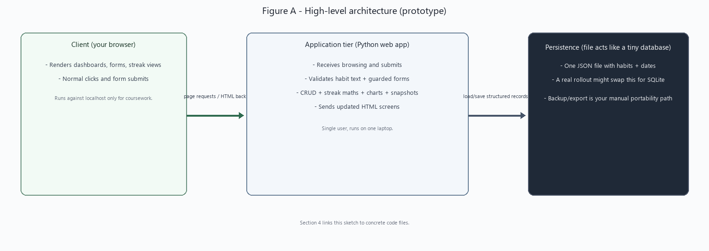
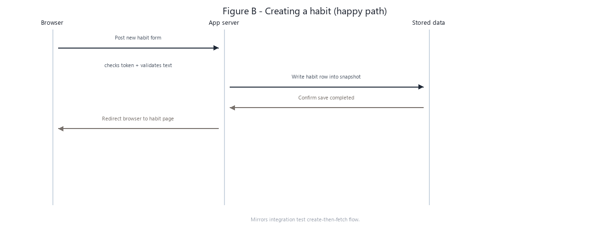
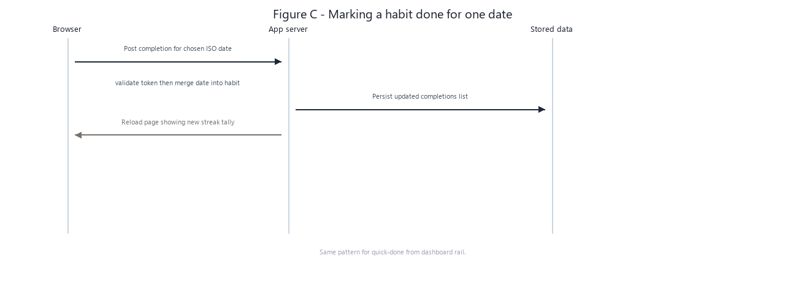

# Mini SDLC Report - Habit Tracker Pro

Module: COMP8066 AI-Powered SDLC, Project 2 (Option A)

Applicant: Chinaza Ogwudiegwu

Student ID: r002316262

Repository: add public GitHub URL when the repo is published

Product name in the UI: Habit Studio

Technical stack: Python 3.11+, Flask 3.x, Jinja2 templates, JSON file on disk

Advanced logic called out in the brief: streak engine in habit_tracker/streak.py, weekly analytics in habit_tracker/analytics.py, and a GitHub-style consistency heatmap in habit_tracker/heatmap.py feeding the habit detail screen.

---

## 1. Requirements

This section freezes what the product must do. Functional rows are the user-visible behaviour. Non-functional rows are the quality and deployment rules (local-only, testable, safe enough for a coursework prototype). Anything not listed as implemented is treated as out of scope even if a commercial app would expect it.

### 1.0 Desk research (no external integrations)

Before locking the MVP I looked at mainstream habit apps (Streaks-style streak language, Loop-style density grids, Todoist-style fast capture, lighter gamified trackers). The goal was UX vocabulary only: readable streaks, quick “done today” capture, and visual density without importing their backend stacks.

Those products assume sign-in, reminders, cloud sync, and sometimes subscriptions. This project cannot call external APIs, so I kept the interaction metaphors and deliberately dropped accounts, push notifications, wearable sync, ML coaching, and hosted analytics. Risk moves from “someone cracks a cloud account” to “someone has physical access to the laptop,” which is spelled out in Section 7.

### 1.1 Functional Requirements (FR)

| ID | Requirement |
|----|-------------|
| FR-1 | User can create a habit with a short required name and optional description. |
| FR-2 | User can list habits with computed current and best streak summaries. |
| FR-3 | User can open a habit detail page with metadata, streaks, completion history, and the weekly bar. |
| FR-4 | User can mark a habit complete for a chosen calendar date (default is the reference “today”). |
| FR-5 | User can clear a completion for a chosen date (repeat clears are harmless). |
| FR-6 | User can edit habit name and description. |
| FR-7 | User can delete a habit after a browser confirmation. |
| FR-8 | Streak engine computes current streak from stored completion dates versus a chosen reference day. |
| FR-9 | Weekly analytics counts Mon through Sun for the ISO week that contains the reference day. |
| FR-10 | Dashboard focus rail lists habits missing today’s completion and offers one POST per habit. |
| FR-11 | Roster sorting via query flags (name, streak, best, recent) for repeatable demos. |
| FR-12 | Consistency heatmap draws several weeks of completion density without pulling chart scripts from CDNs. |
| FR-13 | JSON snapshot export plus a guarded multipart restore with a configured size cap. |
| FR-14 | Theme honours OS preference by default with optional persisted client preference in localStorage. |

### 1.2 Non-Functional Requirements (NFR)

These are framed the way lecturers expect “real” software quality headings, trimmed to what fits a single-user Flask prototype:

| ID | Requirement |
|----|-------------|
| NFR-1 | Fits the coursework contract: runnable on one workstation, Python backend, HTML UI, JSON persistence, zero remote service calls. |
| NFR-2 | Data portability: configurable path (`HABIT_STORE_PATH`) with default `data/store.json` beside the checkout. |
| NFR-3 | Test ergonomics: `HABIT_TODAY` environment switch pins “today” for pytest and repeatable screenshots. |
| NFR-4 | Recoverability under crash: snapshots are written through a temp path then swapped in so a half-written file rarely appears on disk after a laptop kill mid-save. |
| NFR-5 | Maintainability: HTTP stays thin in habit_tracker/app.py while streak, analytics, heatmap, dashboard, storage, validation, and security helpers stay importable modules with their own pytest files. |
| NFR-6 | Mutation safety on forms: POST-only sensitive routes share synchroniser CSRF tokens bound to Flask session helpers in habit_tracker/security.py. |
| NFR-7 | Correctness boundaries: lengths and emptiness enforced server-side in habit_tracker/validation.py rather than trusting browser maxlength alone. |
| NFR-8 | Rough availability guard: multipart restore capped so one enormous upload cannot exhaust disk during class demos. |
| NFR-9 | Documented accessibility intent: colour and motion choices traced in docs/UI_Design_Rationale.md for WCAG-style review. |

### 1.3 Edge cases

- Malformed JSON on disk: load_store raises ValueError; operator fixes or deletes the file (README notes this path).
- Duplicate completion day: normalised to unique ISO strings when serialising so streak logic never counts the same calendar day twice.
- Streak rule: streak only continues if yesterday or reference today is logged, then walks backward day by day; documented in streak.py and guarded by pytest.
- Laptop-only concurrency: simultaneous editor plus dev server could theoretically race writes; coursework assumes one aware operator (see Section 7.1).
- Missing or forged CSRF field: Flask returns HTTP 403 and the error template tells the operator to reload (templates/errors/error.html).
- Unknown habit id in the URL: detail route flashes and redirects to the dashboard rather than dumping a traceback.
- Bad backup upload: malformed JSON or wrong schema is rejected without partially wiping the healthy store (flash messaging only).
- Whitespace-only habit name: validator rejects before persistence even if curl bypassed the browser hints.
- Empty roster UX: KPI widget copies explain there is nothing to score yet rather than crashing division logic.
- Time policy: analytics use the machine-local calendar tied to `HABIT_TODAY` or datetime.date.today; multi-timezone travel is intentionally out of MVP scope.

### 1.4 Requirement to implementation map (abbreviated)

| FR / NFR | Where it lives |
|----------|----------------|
| FR-1 to FR-7 | habit_tracker/app.py routing plus habit_tracker/models.py |
| FR-8 | habit_tracker/streak.py (`tests/test_streak.py`) |
| FR-9 | habit_tracker/analytics.py (`tests/test_analytics.py`) |
| FR-12 | habit_tracker/heatmap.py (`tests/test_heatmap.py`) |
| FR-10, FR-11 | habit_tracker/dashboard.py (`tests/test_dashboard.py`, `tests/test_quick_today.py`) |
| FR-13 | backup routes plus `tests/test_backup_restore.py` |
| NFR-6 CSRF | habit_tracker/security.py (`tests/test_security_and_ops.py`) |
| NFR-4 saves, NFR-7 validation | habit_tracker/storage.py, habit_tracker/validation.py |

Figure files for Word builds: PNG previews live in docs/diagrams/ and regenerate from scripts/make_diagram_pngs.py alongside optional SVG authoring copies.

---

## 2. System Design

### 2.1 High-Level Architecture



Figure A separates what the coursework marker expects to see verbally: presentation in the browser, an application tier that behaves like backend services inside one Flask process, and persistence that substitutes for a miniature database via one JSON snapshot. Implementation detail (temp files, filenames) sits in Sections 4 to 8 so here the diagram stays strategic.

### 2.2 Sequence - Create habit



Figure B is the onboarding path exercised by integration tests (`tests/test_integration.py`): POST the form through the guarded route, persist the structured record, then redirect into the habit detail shell.

### 2.3 Sequence - Mark habit complete for a date



Figure C is the same choreography as the Focus rail shortcut and the `/complete` route exercised in `tests/test_integration_extended.py`: merge the ISO completion into habit state, persist, revisit the refreshed streak output.

Supporting notes: runnable code paths are enumerated in Section 8. Figures embed as raster PNG inside `docs/docx/COMP8066_Final_Submission.docx` when built with scripts/build_final_submission_docx.py.

---

## 3. MVP Selection (Designed vs Implemented vs Deferred)

| Area | Designed | Implemented in MVP | Deferred | Rationale |
|------|----------|--------------------|----------|-----------|
| Habits | Full CRUD | Create, read, update, delete | Recurring templates / rules DSL | Complexity out of coursework window |
| Completions | Dated toggles | Mark and clear plus history listing | Bulk CSV import/export | Keeps JSON schema approachable |
| Streaks | Current and best views | Implemented | Multi-timezone freezes | Single-reference-day contract |
| Analytics | Weekly ISO bar | Implemented | Thirty-day KPI rollups | Matches brief wording |
| UX | Accessible layout | Light/dark, skip-link, flashes | SSO, Progressive Web App | Single-user coursework scope |
| Ops | Clone and run locally | README plus venv | Docker installers | Assignment only asked for local Flask |

Deferred items deliberately lack tests so they cannot be mistaken for silently shipped promises.

---

## 4. Implementation Summary

Run entry point: `python -m habit_tracker` binds Flask to 127.0.0.1:5000 for local demos.

Sessions sign CSRF tokens for every mutating POST; helper lives beside other security-minded utilities.

Habit IDs are opaque strings with UUID completions stored as canonical dates normalised whenever data saves.

Weekly analytics derive from ISO-week boundaries; charts never hit external chart SaaS since everything is rendered server-side.

Templates apply skip-link routing, polite flash banners, semantic tables where markup matters, and stylesheet tokens explained in docs/UI_Design_Rationale.md.

`/healthz` returns JSON sanity check data for narration during video capture.

`/backup` exposes download plus validated upload so assessors see data portability in one click.

Refer to habit_tracker/package files for granular comments; traceability anchors this section to filenames without repeating every line count here.

---

## 5. Testing

### 5.1 Unit Tests (logic layer)

| Module | Focus |
|--------|-------|
| `tests/test_streak.py` | Anchor behaviour, duplicates, gaps, helpers |
| `tests/test_analytics.py` | Week boundary totals |
| `tests/test_models_storage.py` | Serialization, corrupt JSON refusal, deterministic saves |
| `tests/test_validation_units.py` | Name and description guards |
| `tests/test_security_and_ops.py` | CSRF forbids malformed posts, `/healthz` smoke |
| `tests/test_heatmap.py` | Column layout, labelled cells near month rollover |
| `tests/test_dashboard.py` | KPI helpers and sorting tuples |
| `tests/test_backup_restore.py` | Export headers and restore parity |
| `tests/test_quick_today.py` | Focus rail honours sort parameter |

Runner: `pytest -q` (41 tests today). `.github/workflows/ci.yml` repeats the suite on Ubuntu for Python 3.11 and 3.12.

### 5.2 Integration Tests

File `tests/test_integration.py`: (i) POST /habits then read JSON snapshot on disk plus GET `/habits/{id}`, (ii) GET `/` renders the new roster row, (iii) POST `/habits/{id}/delete` empties persisted JSON before redirect handling.

File `tests/test_integration_extended.py`: authenticated POST `/habits/{id}/complete` records an ISO day with CSRF.

### 5.3 Debugging Notes (Representative)

Template paths pinned explicitly relative to repo root packages so starter confusion about Flask static folders vanished early.

Weekly chart percentages always divide by server-calculated denominators (`chart_max`) so Jinja never divides by zero when an empty ISO week slips through integration data.

Older forum snippets hinted at Flask shims incompatible with Flask 3.x routing; authoritative docs outweighed hallucinated decorators.

Rather than mocking CSRF in tests, scrape hidden fields like a browser helper would so integration coverage stays truthful.

---

## 6. Deployment Instructions

### 6.1 Local Run

```text
git clone https://github.com/<your-org-or-username>/aisdlc.git   # substitute when published
cd aisdlc
python -m venv .venv
.\.venv\Scripts\activate
pip install -r requirements.txt
python -m habit_tracker
```

Browser target: http://127.0.0.1:5000 .

### 6.1.1 Report figures for PDF snapshotting

Screens captured from `python -m habit_tracker` complement static HTML mocks under docs/report-figures/. Architecture diagrams build from scripts/make_diagram_pngs.py whenever you rerun scripts/build_final_submission_docx.py.

### 6.2 Highlights of AI-assisted work (cross-reference only)

Brief narrative only; full artefacts sit in Prompt_Decision_Log.md and Prompt_Chats_Appendix.md.

- Requirements/MVP freezes (appendix Sessions 1a–2b).
- Streak and analytics decomposition (Sessions 2–3).
- CSRF hardening drills (Session 4).
- Backup validation contracts (Session 5).
- Heatmap fixes after failing pytest traces (Sessions 6a–b).
- Ethics/STRIDE/diagram narration, CI, Windows PNG bundle, README, UI rationale scaffolding, reflection packaging (appendix Sessions 7–15 — see appendix intro for honest reconstruction wording).

Technique rationale: Prompt_Decision_Log.md 

Transcripts: Prompt_Chats_Appendix.md

---

## 7. Security and Ethics Statement

### 7.1 Trust boundaries (single-operator prototype)

Compared to SaaS architectures with identity primitives, this codebase assumes the workstation user is authorised to read and write habits. Flask listens on localhost in the default README story; widening to an entire LAN subnet would need conscious operator choice plus stronger controls than coursework time allows.

Residual note: concurrency between manual JSON editors and Flask remains a race in theory. Section 1.3 calls that out; Section 7 is where mitigation honesty lives (single aware user, document risk instead of pretending multi-tenant isolation exists).

### 7.2 STRIDE-style lens (coursework scale)

| STRIDE idea | What can go wrong locally | What the build does about it |
|-------------|---------------------------|------------------------------|
| Spoofing | Script on same LAN forges POST | CSRF synchroniser tokens bound to session secret |
| Tampering | Partial JSON write ruins streak history | Writes pass through transient files before swap plus schema checks |
| Repudiation | Not meaningful for lone user | Git history plus pytest artefacts provide engineering trace only |
| Information disclosure | Habit prose is plaintext JSON | README warns operators; backups stay manual/local |
| Denial of service | Huge restore payloads | Flask caps multipart size |

### 7.3 Data handling baseline

Treat habit text as mildly sensitive (health-adjacent). No vendor processes it because nothing leaves the repo unless you copy `store.json` yourself.

Integrity comes from deterministic normalisation plus rebuildable backups described in Functional Requirement 13.

### 7.4 AI-assisted development risks (minimum three spelled out explicitly)

Coursework insists on naming AI risks even if runtime behaviour passes tests:

1. Speculative imports: assistants suggest networking libraries unrelated to offline JSON MVP. Mitigation is watching `requirements.txt` diffs manually and keeping CI pins tight.

2. Calendar folklore regressions: natural language subtly redefines streak boundaries. Mitigation is keeping behaviour locked in streak.py with parametrized pytest and fixed `HABIT_TODAY` seeds.

3. Copy-pasted insecure defaults (debug flags, permissive binds, leaked secrets). Mitigation is documentation plus CSRF/session tests refusing lazy bypasses even in local tests.

4. Ethical halo effect: fluent AI prose hides missing tests if you stop challenging it. Mitigation is treating pytest as the acceptance gate regardless of narration polish.

Integrity posture: appendix logs show human edits versus raw completions; citations should never be pasted untransformed from undocumented third-party coursework dumps.

---

## 8. References (Files)

See repository tree for exhaustive listings; coursework narrative keeps to:

- Flask entry and routes: [`habit_tracker/app.py`](../habit_tracker/app.py)
- CSRF helpers: [`habit_tracker/security.py`](../habit_tracker/security.py)
- Validation: [`habit_tracker/validation.py`](../habit_tracker/validation.py)
- Streaks: [`habit_tracker/streak.py`](../habit_tracker/streak.py)
- Analytics: [`habit_tracker/analytics.py`](../habit_tracker/analytics.py)
- Persistence: [`habit_tracker/storage.py`](../habit_tracker/storage.py)
- Models: [`habit_tracker/models.py`](../habit_tracker/models.py)
- Heatmap: [`habit_tracker/heatmap.py`](../habit_tracker/heatmap.py)
- Dashboard helpers: [`habit_tracker/dashboard.py`](../habit_tracker/dashboard.py)
- UI rationale companion: [`UI_Design_Rationale.md`](UI_Design_Rationale.md)
- Tests: [`tests/`](../tests/)
